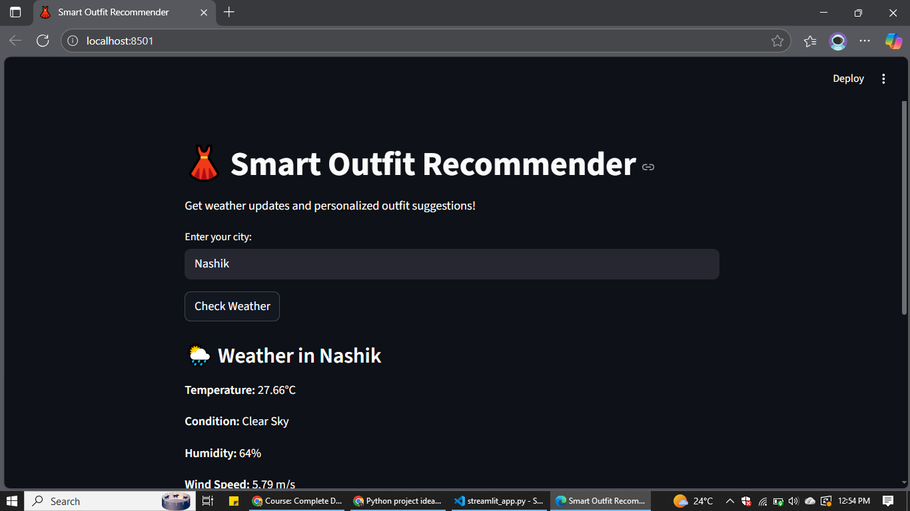
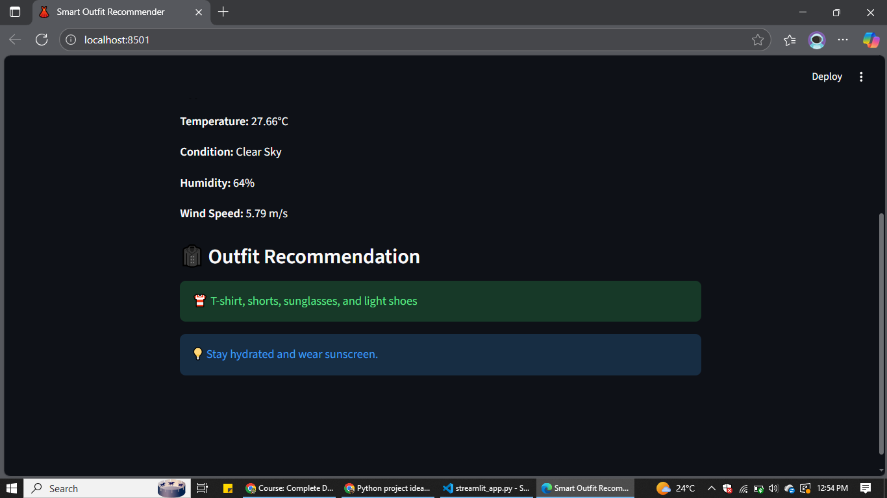

# 👕 Smart Weather-Based Outfit Recommender

A Streamlit web app that recommends daily outfits based on real-time weather data using the OpenWeather API.

## 🌦️ Features
- Fetches live weather data (temperature, humidity, conditions)
- Suggests outfit combinations based on weather
- Built with Python, Streamlit, and OpenWeather API

## 🧰 Tech Stack
- Python
- Streamlit
- OpenWeather API
- Requests library

## 🚀 Run Locally
1. Clone the repo:
   ```bash
   git clone https://github.com/<your-username>/Smart_outfit.git

2. **Install dependencies**
   pip install -r requirements.txt

3. **Add your API key**
   Create a .env file in the root folder

   Add the following line inside:
   OPENWEATHER_API_KEY=your_api_key_here

4. **Run the app**
   streamlit run streamlit_app.py


## 📸 Project Screenshots

Here’s how the Smart Outfit Recommender looks in action:





💡 Future Enhancements

Add outfit images with visual recommendations

Integrate user preferences (e.g., gender, occasion, style)

Make UI mobile-friendly

Add voice-based outfit suggestions
